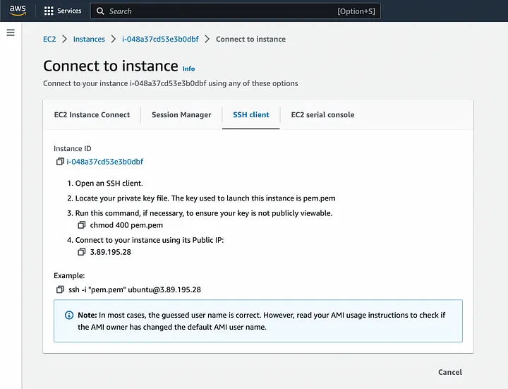

# What is Terraform ? How it works ?

See trailer slides here to get a glimpse of [what is terraform](https://docs.google.com/presentation/d/1poFdfipf6qKC6WHynNGjUyE9SQ-TqgHG2O5vrljjgBo/edit?usp=sharing).

Terraform is an infrastructure as code tool that lets you define both cloud and on-prem resources in human-readable configuration files that you can version, reuse, and share.

## How does Terraform works ?

Terraform is able to creates and manages resources on cloud platforms through what it's called by **Providers**. Providers act as a bridge among terraform and cloud platforms via their API's.

<figure><figcaption></figcaption></figure>

Terraform workflow consist of threes stages :&#x20;

1. **Write:** You write the actual terraform code to define what resources you want to deploy.
2. **Plan:**  Terraform create execution plan simulating what resources will be changed.
3. **Apply:** Terraform performs changes that was planned, on approval.

<figure><figcaption></figcaption></figure>

## Why Terraform ?

*   **Manage any infrastructure:** Terraform has providers that can talk to various cloud platforms that we can already use in the [Terraform Registry](https://registry.terraform.io/). Terraform takes an immutable approach to infrastructure.\

    <figure><figcaption></figcaption></figure>
* **Track your infrastructure:** Terraform saves a representation of a state of your infra in a state file, which act as a source of truth to your infra. Terraform uses the [state file](https://developer.hashicorp.com/terraform/language/state) to determine the changes to make to your infrastructure so that it will match your configuration.
* **Automate changes:** Terraform configuration files (\*.tf) are declarative, meaning that they describe what your infra are intended to be. You don't need to write step-by step instructions to create/modify resources as terraforms handles the underlying logic under the hood.
* **Standardize configurations:** Terraform has a feature called [modules](https://developer.hashicorp.com/terraform/language/modules), that enables us to define configurable collections of infrastructure. i.e.:  we can make k8s module that consist of multiple resources like creating, ingress, services, etc.
* **Collaborate:** Because Terraform saves state in a file, meaning we can version control it and modify it collaboratively.

## IaC vs Configuration Management 

<figure><figcaption></figcaption></figure>

<figure><figcaption></figcaption></figure>

<figure><figcaption></figcaption></figure>
