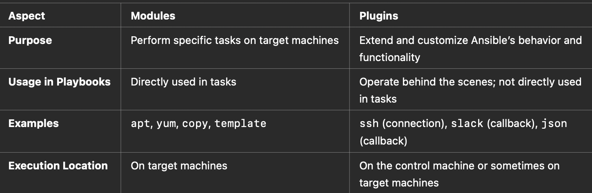

# Ansible Modules

## Introduction to modules

Modules (also referred to as “task plugins” or “library plugins”) are discrete units of code that can be used from the command line or in a playbook task. Ansible executes each module, usually on the remote managed node, and collects return values. In Ansible 2.10 and later, most modules are hosted in collections.

You can execute modules from the command line.

```
ansible webservers -m service -a "name=httpd state=started"
ansible webservers -m ping
ansible webservers -m command -a "/sbin/reboot -t now"
```

service, ping, command are all modules.

## Modules vs Plugins : The Basics

• Modules and plugins are both essential components of Ansible, but they serve different purposes.

• Think of modules as the “what to do” parts, while plugins are the “how to do it” parts.

### Ansible Modules

Modules are the building blocks of Ansible tasks. They define the specific actions that Ansible performs on your systems.

**Key Points about Modules:**

**1. Functionality:**

• Modules perform specific tasks like installing software, managing files, configuring services, etc.

**2. Usage:**

• When you write an Ansible playbook (a YAML file with tasks), each task typically uses a module.

**3. Types:**

• There are hundreds of built-in modules for different purposes, such as:

• File Modules: Manage file properties (e.g., file, copy, template).

• Package Modules: Install or manage software packages (e.g., apt, yum).

• Cloud Modules: Manage cloud resources (e.g., aws\_ec2, azure\_rm).

4\. Execution:

• Modules are executed on the target machines (the machines you’re managing).

#### Example of a Module in a Playbook:&#x20;

```yaml
- name: Install Nginx
  apt:
    name: nginx
    state: present
```

• Here, apt is the module used to manage packages on Debian-based systems.

• This task uses the apt module to ensure Nginx is installed.

### Ansible Plugins

Plugins extend the core functionality of Ansible. They are like add-ons that help Ansible handle different aspects of execution, processing, and behavior.

**Key Points about Plugins:**

1\. Functionality:

• Plugins handle things like connecting to remote machines, logging, handling callbacks, and modifying how tasks run.

2\. Usage:

• Plugins are not usually called directly in playbooks. Instead, they work behind the scenes to enhance Ansible’s capabilities.

3\. Types:

• There are various types of plugins, including:

• Connection Plugins: Define how Ansible connects to remote systems (e.g., SSH, WinRM).

• Callback Plugins: Handle notifications and logging (e.g., displaying task results in different formats).

• Lookup Plugins: Retrieve data from external sources (e.g., fetching secrets from a vault).

• Filter Plugins: Modify data within playbooks (e.g., changing the format of a string).

4\. Execution:

• Plugins are executed on the control machine (where you run Ansible) or sometimes on the target machines, depending on the plugin type.

Example of a Plugin:

• Callback Plugin Example:

• Suppose you want Ansible to send a notification to Slack after a playbook runs. You can use a callback plugin that triggers a Slack message upon playbook completion.

#### How They Work Together

Imagine you’re baking a cake:

• Modules are like the individual ingredients and steps (e.g., mix flour, add eggs, bake in the oven).

• Plugins are like the kitchen tools and helpers that make the baking process smoother (e.g., mixers, timers, recipe organizers).

Both are essential for successfully baking the cake, just as modules and plugins are crucial for Ansible to automate tasks effectively.

**Summary of Differences**

<figure><figcaption></figcaption></figure>

## Hands On: Let's use docker compose plugin

